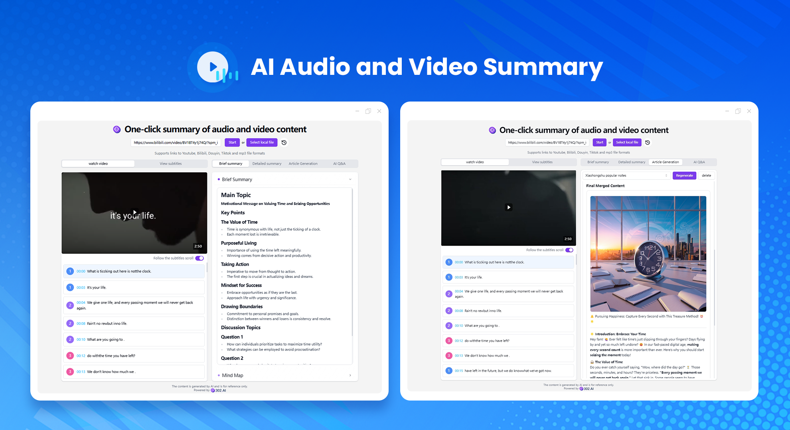
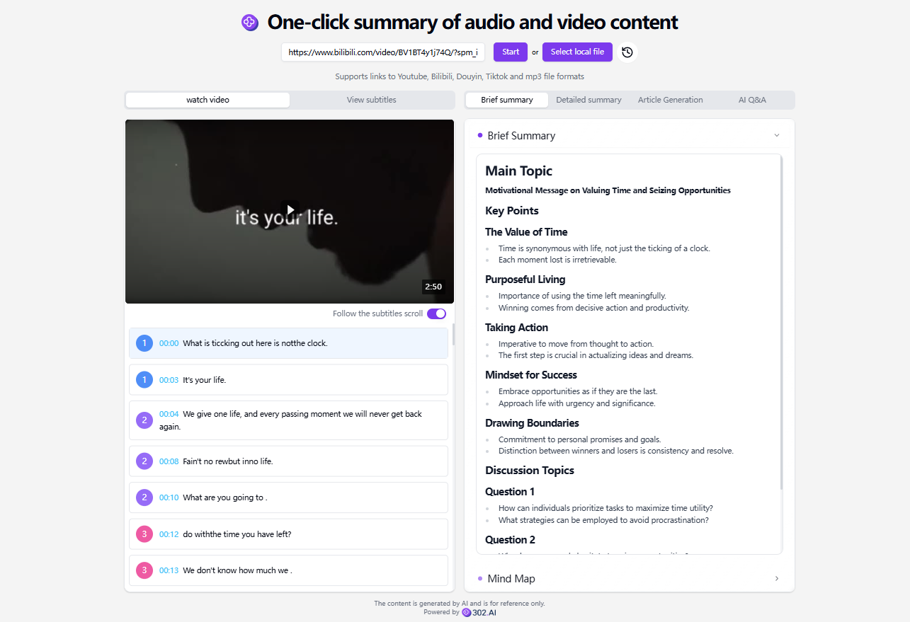
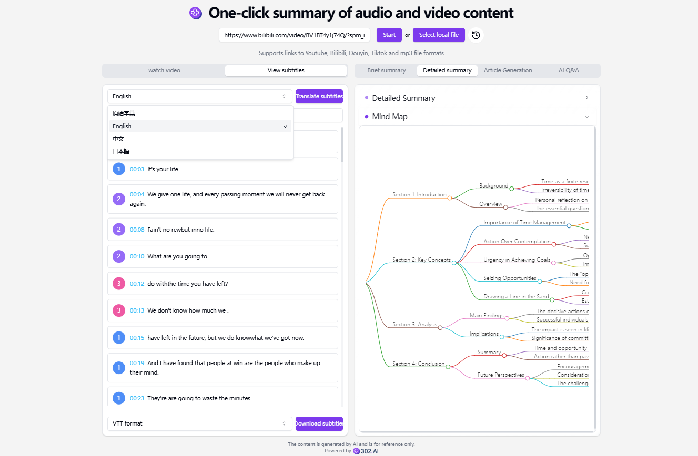
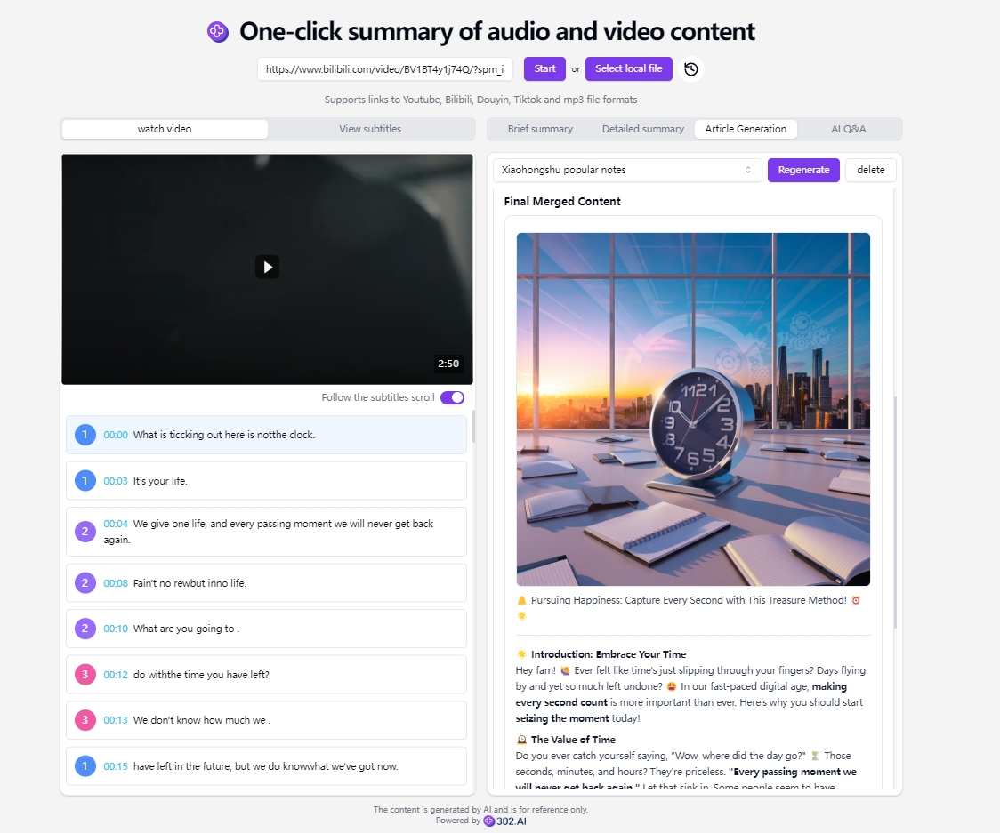
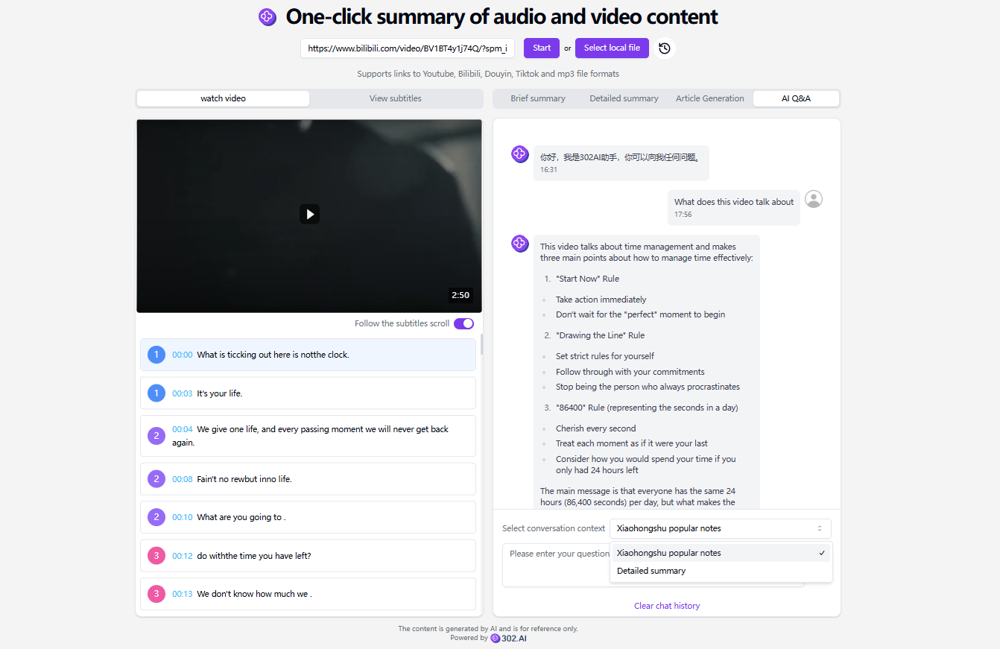

# 
🎥 AI Audio and Video Summary 🚀✨

AI audio and video summarization supports summarizing the subtitle content of audio and video from YouTube, Bilibili, Douyin, Xiaohongshu as well as links to mp3 and mp4 files on the Internet, and generating mind maps. It can also translate the subtitles, download them in SRT or TXT format, and use the video content as context to have conversations with AI large models, enabling users to quickly understand the video content.

<a href="README_zh.md">中文</a> | <a href="README.md">English</a> | <a href="README_ja.md">日本語</a>

 

Open-source version of the [AI Audio and Video Summary](https://302.ai/product/detail/30) from [302.AI](https://302.ai/en/).
You can directly log in to 302.AI for a zero-code, zero-configuration online experience.
Alternatively, customize this project to suit your needs, integrate 302.AI's API KEY, and deploy it yourself.

## UI Preview
Generate a brief summary and mind map based on the uploaded audio/video link or file.
     

It can translate the subtitles and generate a detailed summary and mind map.
     

Article generation function, providing a variety of template options, and you can also customize templates.

By selecting the conversation context, you can ask and answer questions with AI to learn more information related to audio and video.
  

## Project Features
### 🎥 Automatic Video Summary Generation
It can be easily completed by uploading videos.
### 🌐 Multi-platform Videos
It supports videos from multiple platforms: YouTube, TikTok, Bilibili, Douyin, MP4, etc.
### 🌎 Subtitle Translation
Subtitle translation supports Chinese, English and Japanese.
### 📄 Subtitle Download
Various subtitle formats can be downloaded: VTT, SRT and TXT formats are supported.
### ✍️ Brief Summary
It provides a brief summary service to quickly extract the key points of videos.
### 📚 Detailed Summary
It provides a detailed summary service to deeply analyze the content of videos.
### ✒️ Article Generation
Offer a variety of template options. You can also customize templates to generate the article format you want.
### 🤖 AI Q&A 
iInteract with AI, which will intelligently answer questions related to videos.
### 🌙 Dark Mode
Switch as you like for more comfortable eye protection.
### 🔗 Share Summary
You can share the summary and share wonderful content with friends.
### 🌍 Multi-language Support
- Chinese Interface
- English Interface
- Japanese Interface

With AI Audio and Video Summary, anyone can efficiently obtain video information! 🎉🎥 Let's explore the new world of AI-driven information acquisition together! 🌟🚀

## 🚩 Future Update Plans 
- [ ] Expand the compatibility with other audio and video formats
- [ ] Provide personalized customization options. For example, users can choose the level of detail for the summary (brief summary or detailed analysis), the style of the mind map (logic diagram, fishbone diagram, etc.), and the language style of the translation (formal, colloquial, etc.) according to their own needs, so that the generated results better meet the usage preferences and specific application scenarios of different users

## Tech Stack
- Next.js 14
- Tailwind CSS
- Shadcn UI
- markmap
- Vercel AI SDK

## Development & Deployment
1. Clone the project `git clone https://github.com/302ai/302_video_summary`
2. Install dependencies `pnpm install`
3. Configure the 302 API KEY as per .env.example
4. Run the project `pnpm dev`
5. Build and deploy `docker build -t video-summary . && docker run -p 3000:3000 video-summary`

## ✨ About 302.AI ✨
[302.AI](https://302.ai) is an enterprise-oriented AI application platform that offers pay-as-you-go services, ready-to-use solutions, and an open-source ecosystem.✨
1. 🧠 Comprehensive AI capabilities: Incorporates the latest in language, image, audio, and video models from leading AI brands.
2. 🚀 Advanced application development: We build genuine AI products, not just simple chatbots.
3. 💰 No monthly fees: All features are pay-per-use, fully accessible, ensuring low entry barriers with high potential.
4. 🛠 Powerful admin dashboard: Designed for teams and SMEs - managed by one, used by many.
5. 🔗 API access for all AI features: All tools are open-source and customizable (in progress).
6. 💡 Powerful development team: Launching 2-3 new applications weekly with daily product updates. Interested developers are welcome to contact us.
