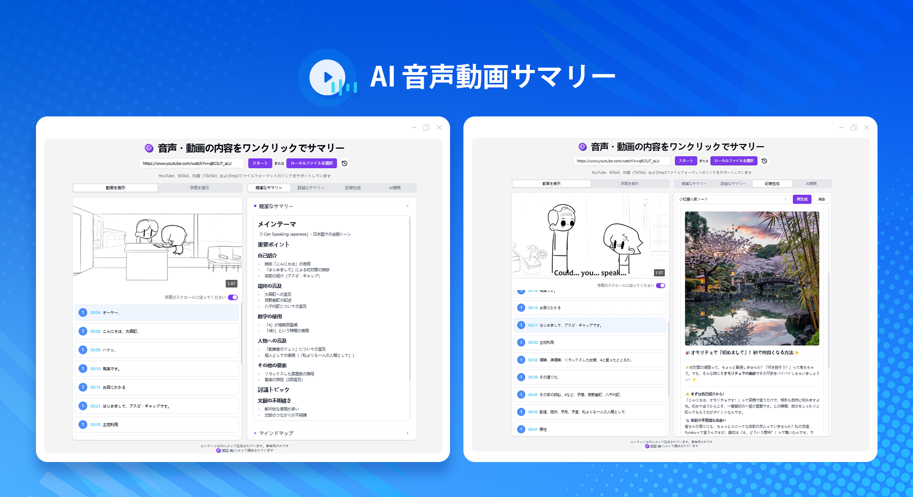
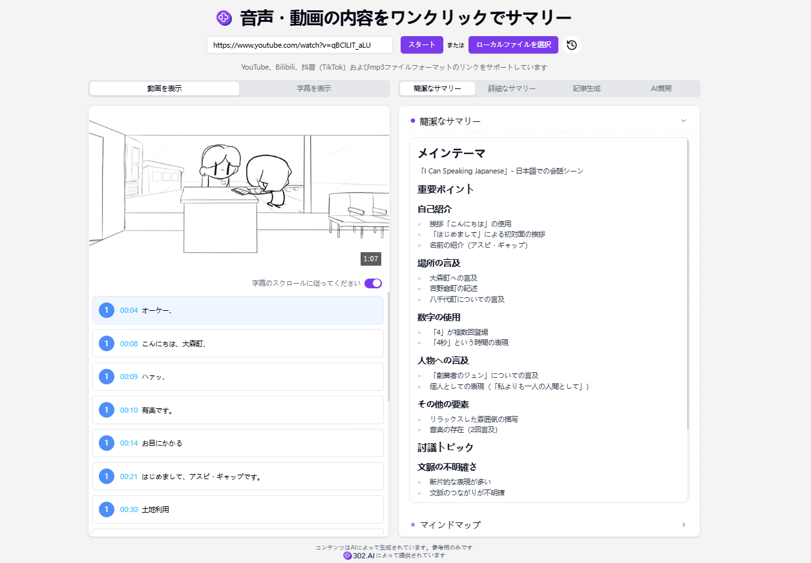
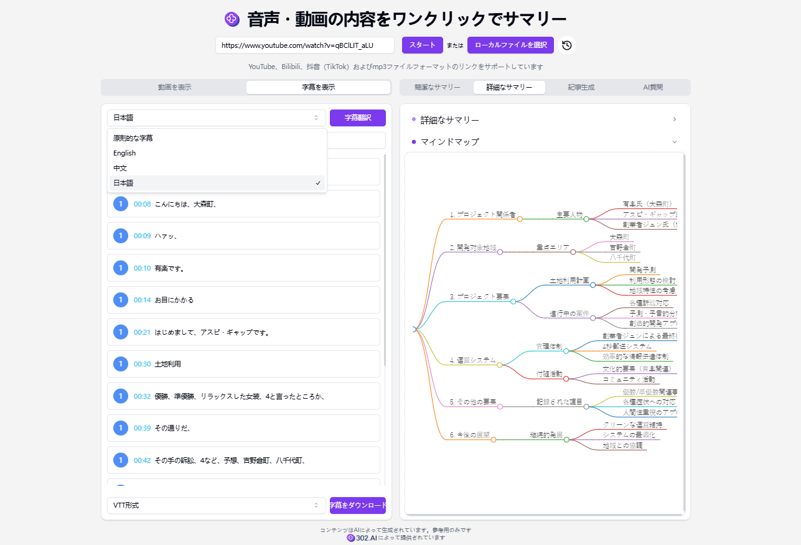
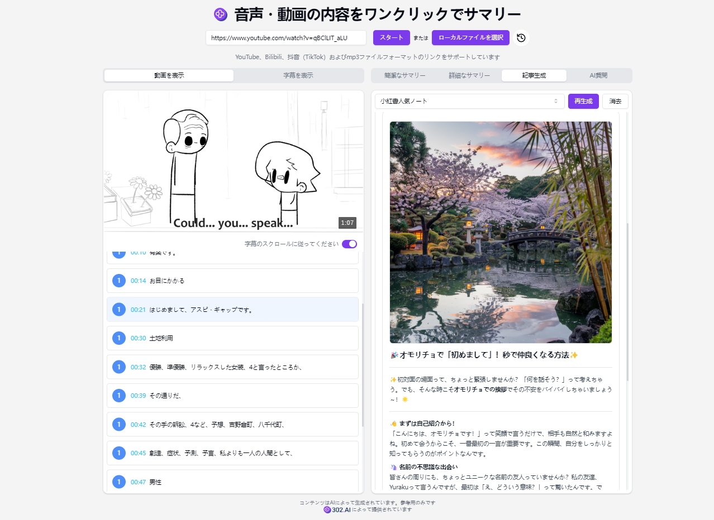
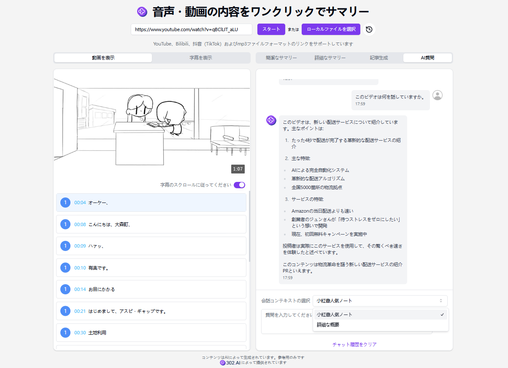

# 
🎥 AI 音声動画サマリー🚀✨

AI 音声・ビデオ要約機能は、YouTube、ビリビリ、抖音、小红书、およびインターネット上の mp3、mp4 ファイルのリンクにある音声・ビデオの字幕内容を要約し、マインドマップを生成することができます。また、字幕を翻訳し、SRT 形式または TXT 形式でダウンロードすることもでき、ビデオ内容をコンテキストとして AI の大規模モデルと会話を行い、ビデオ内容を迅速に理解することができます。

<a href="README_zh.md">中文</a> | <a href="README.md">English</a> | <a href="README_ja.md">日本語</a>

 

[302.AI](https://302.ai/ja/)の[AI音声動画サマリー](https://302.ai/product/detail/30)のオープンソース版です。
302.AIに直接ログインすることで、コード不要、設定不要のオンライン体験が可能です。
あるいは、このプロジェクトをニーズに合わせてカスタマイズし、302.AIのAPI KEYを統合して、自身でデプロイすることもできます。

## インターフェースプレビュー
アップロードされた音声/ビデオのリンクまたはファイルに基づいて、簡単な要約とマインドマップを作成します。 
     

字幕の翻訳が可能で、詳細な要約とマインドマップを生成することができます。
     

文章生成機能で、さまざまなテンプレートオプションを提供し、テンプレートをカスタマイズすることもできます。 

会話のコンテキストを選択することで、AIと質問と回答を行い、音声やビデオに関連する詳細情報を学ぶことができます 。
  

## プロジェクトの特徴
### 🎥 自動的なビデオ要約生成
ビデオを簡単にアップロードするだけで完了できます。
### 🌐 多プラットフォームのビデオ
YouTube、TikTok、ビリビリ、抖音、MP4 など、複数のプラットフォームのビデオをサポートしています。
### 🌎 字幕翻訳
字幕翻訳は中国語、英語、日本語をサポートしています。
### 📄 字幕ダウンロード
さまざまな字幕形式をダウンロードできます。VTT、SRT、TXT 形式がサポートされています。
### ✍️ 簡潔な要約
簡潔な要約サービスを提供し、ビデオの要点を迅速に抽出します。
### 📚 詳細な要約
詳細な要約サービスを提供し、ビデオの内容を深く解析します。
### ✒️ 文章生成
さまざまなテンプレートオプションを提供します。独自のテンプレートも作成でき、あなたが望む文章形式を生成できます。
### 🤖 AI の質疑応答
AI と相互作用し、ビデオに関連する質問に知的に答えます。
### 🌙 ダークモード
好きなように切り替えることができ、目を保護して快適になります。
### 🔗 要約の共有
要約を共有し、素敵な内容を友人と共有できます。
### 🌍 多言語サポート
- 中国語インターフェース
- 英語インターフェース
- 日本語インターフェース

AI音声動画サマリーを通じて、誰でも効率的に動画情報を取得できます！🎉🎥 AI駆動の情報取得の新しい世界を一緒に探求しましょう！🌟🚀

## 🚩 将来のアップデート計画
- [ ] 他の音声・ビデオ形式との互換性を拡大する
- [ ] 個性化されたカスタマイズオプションを提供する。例えば、ユーザーは自身のニーズに応じて、要約の詳細度（簡略な要約や詳細な整理など）、マインドマップのスタイル（論理図、フィッシュボーン図など）、翻訳の言語スタイル（正式なもの、口語体など）を選択することができ、生成された結果がさまざまなユーザーの使用上の好みや具体的な応用シーンにより合致するようにする

## 技術スタック
- Next.js 14
- Tailwind CSS
- Shadcn UI
- markmap
- Vercel AI SDK

## 開発とデプロイ
1. プロジェクトをクローン `git clone https://github.com/302ai/302_video_summary`
2. 依存関係をインストール `pnpm install`
3. 302のAPIキーを.env.exampleに従って設定
4. プロジェクトを実行 `pnpm dev`
5. ビルドとデプロイ `docker build -t video-summary . && docker run -p 3000:3000 video-summary`

## ✨ 302.AIについて ✨
[302.AI](https://302.ai)は企業向けのAIアプリケーションプラットフォームであり、必要に応じて支払い、すぐに使用できるオープンソースのエコシステムです。✨
1. 🧠 包括的なAI機能：主要AIブランドの最新の言語、画像、音声、ビデオモデルを統合。
2. 🚀 高度なアプリケーション開発：単なるシンプルなチャットボットではなく、本格的なAI製品を構築。
3. 💰 月額料金なし：すべての機能が従量制で、完全にアクセス可能。低い参入障壁と高い可能性を確保。
4. 🛠 強力な管理ダッシュボード：チームやSME向けに設計 - 一人で管理し、多くの人が使用可能。
5. 🔗 すべてのAI機能へのAPIアクセス：すべてのツールはオープンソースでカスタマイズ可能（進行中）。
6. 💪 強力な開発チーム：大規模で高度なスキルを持つ開発者集団。毎週2-3の新しいアプリケーションをリリースし、毎日製品更新を行っています。才能ある開発者の参加を歓迎します。
