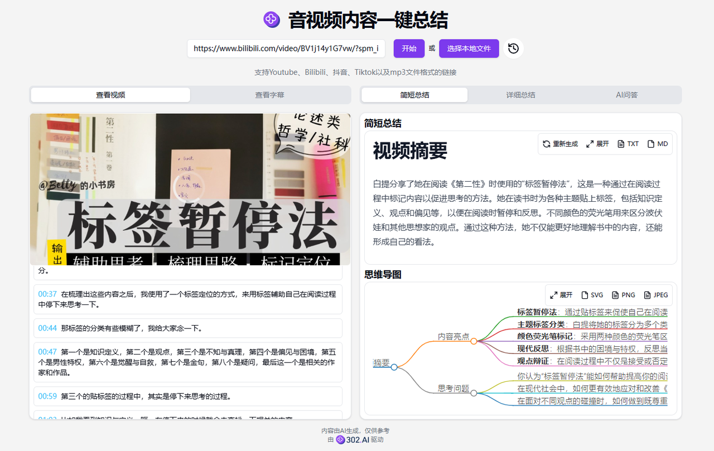
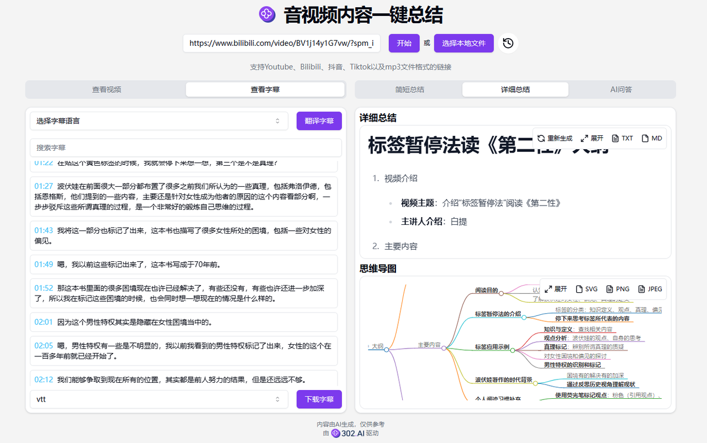
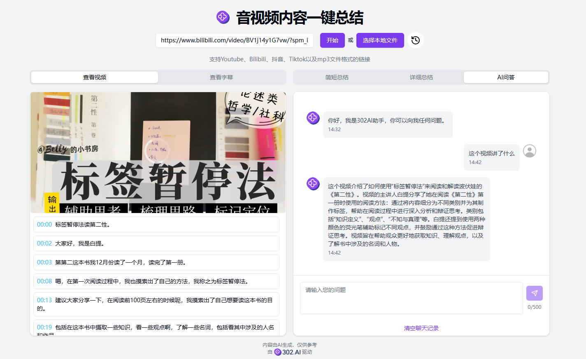

# 
🎥 AI 音视频总结 🚀✨

AI音视频总结支持将Youtube、Bilibili、抖音、小红书以及网络上mp3、mp4文件链接的音视频字幕内容进行总结，并生成思维导图，还可以将字幕进行翻译，下载为SRT格式或TXT格式，还可将视频内容作为上下文与AI大模型进行对话，快速了解视频内容。

<a href="README zh.md">中文</a> | <a href="README.md">English</a> | <a href="README_ja.md">日本語</a>

来自[302.AI](https://302.ai)的[AI音视频总结](https://302.ai/tools/videosum/)的开源版本。你可以直接登录302.AI，零代码零配置使用在线版本。或者对本项目根据自己的需求进行修改，传入302.AI的API KEY，自行部署。

## 界面预览

## 项目特性
### 🎥 自动生成视频总结
  轻松上传视频即可完成。
### 🌐 多平台视频
  支持多个平台的视频：YouTube、TikTok、Bilibili、抖音、MP4等。
### 🌎 字幕翻译
  字幕翻译支持中文、英文、日文。
### 📄 字幕下载
  可下载多种字幕格式：支持VTT、SRT、TXT格式。
### ✍️ 简短总结
  提供简短总结服务，快速提取视频要点。
### 📚 详细总结
  提供详细总结服务，深度解析视频内容。
### 🤖 AI问答
  与AI进行互动，智能回答视频相关问题。
### 🌙 暗色模式
  随心切换，护眼更舒适。
### 🔗 分享总结
  可分享总结，与好友共享精彩内容。
### 🌍 多语言支持
  - 中文界面
  - English Interface
  - 日本語インターフェース

通过AI音视频总结,任何人都可以高效获取视频信息! 🎉🎥 让我们一起探索AI驱动的信息获取新世界吧! 🌟🚀

## 🚩 未来更新计划
- 拓宽对其他音视频格式的兼容
- 个性化定制选项，比如用户可以根据自己的需求选择总结的详细程度（简略概括或详细梳理）、思维导图的样式风格（逻辑图、鱼骨图等）、翻译的语言风格（正式、口语化等），让生成的结果更符合不同用户的使用偏好和具体应用场景
  
## 技术栈
- Next.js 14
- Tailwind CSS
- Shadcn UI
- markmap
- Vecel AI SDK

## 开发&部署
1. 克隆项目 `git clone https://github.com/302ai/302_video_summary`
2. 安装依赖 `pnpm install`
3. 配置302的API KEY 参考.env.example
4. 运行项目 `pnpm dev`
5. 打包部署 `docker build -t video-summary . && docker run -p 3000:3000 video-summary`

## ✨ 302.AI介绍 ✨
[302.AI](https://302.ai)是一个按需付费的AI应用平台，为用户解决AI用于实践的最后一公里问题。
1. 🧠 集合了最新最全的AI能力和品牌，包括但不限于语言模型、图像模型、声音模型、视频模型。
2. 🚀 在基础模型上进行深度应用开发，我们开发真正的AI产品，而不是简单的对话机器人
3. 💰 零月费，所有功能按需付费，全面开放，做到真正的门槛低，上限高。
4. 🛠 功能强大的管理后台，面向团队和中小企业，一人管理，多人使用。
5. 🔗 所有AI能力均提供API接入，所有工具开源可自行定制（进行中）。
6. 💡 强大的开发团队，每周推出2-3个新应用，产品每日更新。有兴趣加入的开发者也欢迎联系我们
